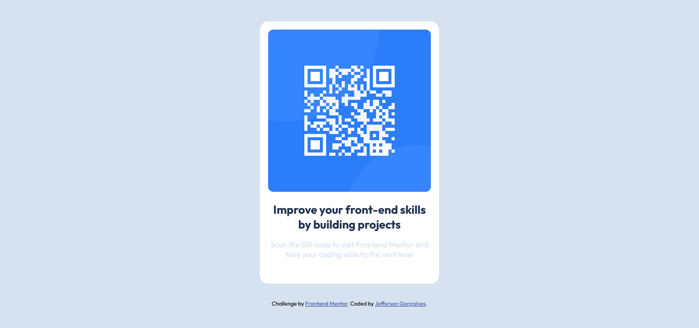

# Frontend Mentor - QR code component solution

This is a solution to the [QR code component challenge on Frontend Mentor](https://www.frontendmentor.io/challenges/qr-code-component-iux_sIO_H). Frontend Mentor challenges help you improve your coding skills by building realistic projects. 

## Table of contents

- [Overview](#overview)
  - [Screenshot](#screenshot)
  - [Links](#links)
- [My process](#my-process)
  - [Built with](#built-with)
  - [What I learned](#what-i-learned)
- [Author](#author)


## Overview

### Screenshot



### Links

- Solution URL: [Add solution URL here](https://your-solution-url.com)
- Live Site URL: [Add live site URL here](https://your-live-site-url.com)

### Built with

- HTML5 markup
- CSS custom properties
- Flexbox

### What I learned

I learned that the use of good accessibility practices in HTML is increasingly fundamental in font end development. A large part of the content present on the internet can become accessible only with the correct use of HTML elements. For example, multimedia content - image/video cannot be seen by people with visual impairments, as well as audio content cannot be heard by people with hearing impairment.
In the project I learned the importance of the "alt" feature to provide screen readers with the representation of the image that will be used.

```html

```

In css, I was able to learn techniques for centering elements on the screen using flexbox. But its use goes further and is efficient to create layouts, distribute spaces between items in a container, even when the dimensions of these items are unknown or dynamic.

```css
body {
  display: flex;
  justify-content: center;
  align-items: center;
  min-height: 100vh;
}
```

If you want more help with writing markdown, we'd recommend checking out [The Markdown Guide](https://www.markdownguide.org/) to learn more.


## Author

- Website - [Add your name here](https://www.your-site.com)
- Frontend Mentor - [@yourusername](https://www.frontendmentor.io/profile/yourusername)
- Twitter - [@yourusername](https://www.twitter.com/yourusername)
